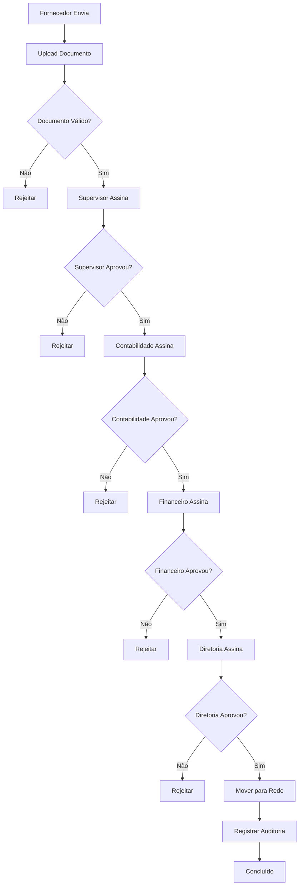

# 🔄 Fluxo de Assinaturas - Diagrama BPMN

## 📊 Diagrama do Processo

## 🎯 Etapas do Processo

1. **Fornecedor** → Envia nota fiscal
2. **Supervisor** → Analisa e assina
3. **Contabilidade** → Analisa e assina  
4. **Financeiro** → Analisa e assina
5. **Diretoria** → Assinatura final
6. **Sistema** → Move para pasta e registra auditoria
