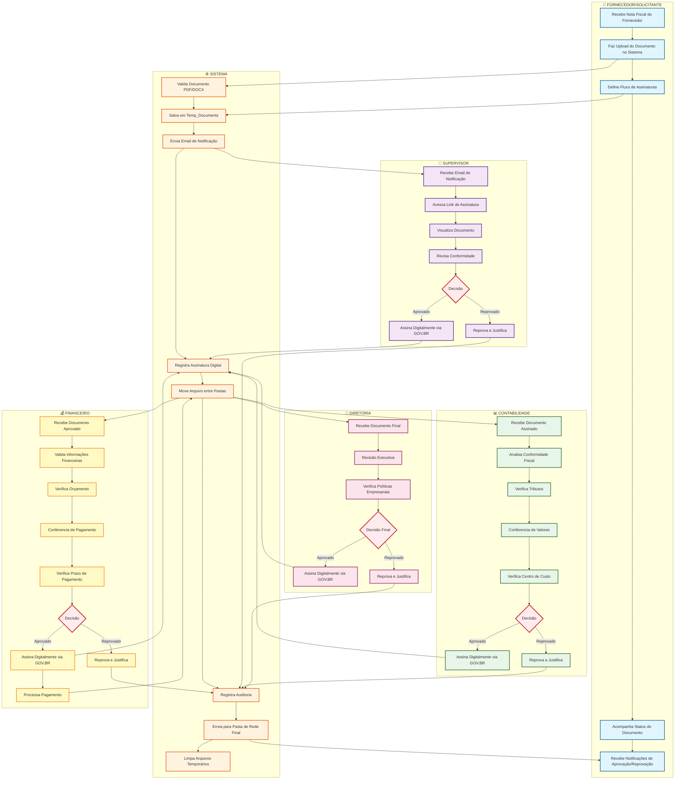
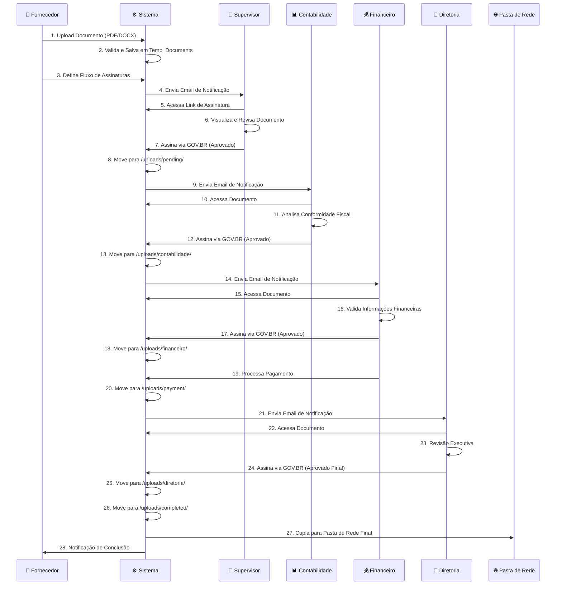

# 🔄 FLUXO EM RAIAS - SISTEMA DE NOTAS FISCAIS

## 📊 Diagrama de Fluxo em Raias (Swimlanes)

Este diagrama mostra o processo completo de aprovação de notas fiscais, identificando claramente as responsabilidades de cada ator envolvido no processo.

## 🔄 Fluxo Sequencial em Raias

## 📋 Descrição Detalhada por Raia

### 👤 **FORNECEDOR/SOLICITANTE**

**Responsabilidades:**
- Receber nota fiscal do fornecedor externo
- Fazer upload do documento no sistema
- Definir o fluxo sequencial de assinaturas
- Acompanhar o status do documento
- Receber notificações sobre aprovações/reprovações

**Ações Principais:**
1. Upload de arquivo (PDF/DOCX, máximo 10MB)
2. Seleção de signatários na ordem correta
3. Monitoramento do progresso do documento

---

### ⚙️ **SISTEMA**

**Responsabilidades:**
- Validação de documentos
- Gerenciamento de arquivos
- Envio de notificações automáticas
- Registro de assinaturas digitais
- Movimentação de arquivos entre pastas
- Auditoria e logs
- Integração com GOV.BR
- Envio final para pasta de rede

**Pastas Utilizadas:**
- `/temp_documents/` - Upload temporário
- `/uploads/pending/` - Aguardando primeira aprovação
- `/uploads/contabilidade/` - Aprovado por contabilidade
- `/uploads/financeiro/` - Aprovado por financeiro
- `/uploads/diretoria/` - Aprovado por diretoria
- `/uploads/payment/` - Processamento de pagamento
- `/uploads/completed/` - Documento concluído
- `Y:\TECNOLOGIA DA INFORMAÇÃO\3. Sistemas\Karla\[SETOR]` - Pasta final de rede

---

### 👔 **SUPERVISOR**

**Responsabilidades:**
- Receber e revisar documento inicial
- Verificar conformidade básica
- Assinar digitalmente via GOV.BR
- Aprovar ou reprovar com justificativa

**Critérios de Aprovação:**
- Documento completo e legível
- Fornecedor válido
- Conformidade básica

**Tempo Médio:** 5-15 minutos

---

### 📊 **CONTABILIDADE**

**Responsabilidades:**
- Receber documento assinado pelo supervisor
- Analisar conformidade fiscal
- Verificar tributação correta
- Conferir valores e cálculos
- Validar centro de custo
- Assinar digitalmente via GOV.BR

**Critérios de Aprovação:**
- Tributos corretos
- Valores conferidos
- Centro de custo adequado
- Documentos complementares presentes

**Tempo Médio:** 15-30 minutos

---

### 💰 **FINANCEIRO**

**Responsabilidades:**
- Receber documento aprovado pela contabilidade
- Validar informações financeiras
- Verificar disponibilidade orçamentária
- Conferir prazo de pagamento
- Processar pagamento
- Assinar digitalmente via GOV.BR

**Critérios de Aprovação:**
- Dentro do orçamento
- Prazo de pagamento adequado
- Informações financeiras corretas

**Tempo Médio:** 15-30 minutos

---

### 🏢 **DIRETORIA**

**Responsabilidades:**
- Receber documento para aprovação final
- Revisão executiva
- Verificar conformidade com políticas empresariais
- Assinatura final via GOV.BR

**Critérios de Aprovação:**
- Conforme políticas internas
- Alinhado com estratégia empresarial

**Tempo Médio:** 30 minutos - 1 hora

---

## 🔀 Pontos de Decisão (Gateways)

### **1. Validação de Documento (Sistema)**
- ✅ Documento válido → Continua fluxo
- ❌ Documento inválido → Rejeição imediata

### **2. Aprovação Supervisor**
- ✅ Aprovado → Envia para Contabilidade
- ❌ Reprovado → Retorna para Fornecedor com justificativa

### **3. Aprovação Contabilidade**
- ✅ Aprovado → Envia para Financeiro
- ❌ Reprovado → Retorna para Fornecedor com justificativa

### **4. Aprovação Financeiro**
- ✅ Aprovado → Processa pagamento → Envia para Diretoria
- ❌ Reprovado → Retorna para Fornecedor com justificativa

### **5. Aprovação Diretoria**
- ✅ Aprovado → Finaliza e envia para pasta de rede
- ❌ Reprovado → Retorna para Fornecedor com justificativa

---

## 📊 Status do Documento no Fluxo

| Status | Descrição | Localização |
|--------|-----------|-------------|
| `temp_upload` | Upload temporário aguardando primeira assinatura | `/temp_documents/` |
| `pending` | Aguardando aprovação da contabilidade | `/uploads/pending/` |
| `contabilidade_approved` | Aprovado pela contabilidade | `/uploads/contabilidade/` |
| `financeiro_approved` | Aprovado pelo financeiro | `/uploads/financeiro/` |
| `payment_processed` | Pagamento processado | `/uploads/payment/` |
| `diretoria_approved` | Aprovado pela diretoria | `/uploads/diretoria/` |
| `completed` | Processo concluído | `/uploads/completed/` → Pasta de Rede |

---

## 🔐 Segurança e Auditoria

### **Registros de Auditoria:**
- ✅ Todas as ações são registradas com timestamp
- ✅ IP do dispositivo é capturado
- ✅ Usuário responsável é registrado
- ✅ Assinatura digital GOV.BR com validade jurídica
- ✅ Histórico completo disponível para consulta

### **Validações:**
- ✅ Tipo de arquivo (PDF/DOCX apenas)
- ✅ Tamanho máximo (10MB)
- ✅ Ordem sequencial obrigatória
- ✅ Usuário autorizado para cada etapa
- ✅ Verificação de permissões por role

---

## ⏱️ Tempo Total Estimado do Processo

| Etapa | Tempo Médio | Acumulado |
|-------|-------------|-----------|
| Upload e Configuração | 5 min | 5 min |
| Supervisor | 10 min | 15 min |
| Contabilidade | 20 min | 35 min |
| Financeiro | 20 min | 55 min |
| Diretoria | 30 min | **1h 25min** |

**Nota:** Tempos podem variar conforme complexidade do documento e urgência.

---

## 🎯 Benefícios do Fluxo em Raias

1. **Clareza de Responsabilidades:** Cada ator sabe exatamente o que deve fazer
2. **Rastreabilidade:** Fácil identificar onde o documento está em cada momento
3. **Eficiência:** Processo automatizado reduz tempo de aprovação
4. **Segurança:** Assinaturas digitais com validade jurídica
5. **Auditoria:** Histórico completo de todas as ações
6. **Padronização:** Processo uniforme para todos os documentos

---

**Versão:** 1.0  
**Data de criação:** Janeiro 2025  
**Uso:** Documentação do fluxo de aprovação de notas fiscais com raias

