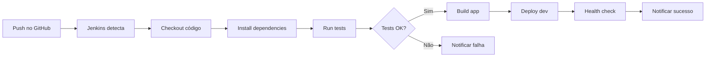

# 🚀 Jenkins CI/CD - Sistema de Assinaturas

Este diretório contém toda a configuração necessária para automatizar o processo de desenvolvimento, teste e deploy do Sistema de Assinaturas usando Jenkins.

## 📁 Estrutura do Projeto

```
jenkins/
├── 📄 docker-compose.yml          # Configuração do Docker para Jenkins
├── 📄 start-jenkins.bat           # Script para iniciar Jenkins no Windows
├── 📄 README.md                   # Este arquivo
├── 📁 scripts/                    # Scripts de automação
│   ├── 📄 build.sh               # Script de build
│   ├── 📄 test.sh                # Script de testes
│   └── 📄 deploy.sh              # Script de deploy
└── 📁 config/                     # Configurações
    └── 📄 nginx.conf             # Configuração do Nginx
```

## 🚀 Como Usar

### 1. **Iniciar Jenkins**

#### **Windows:**
```bash
# Execute o script de inicialização
jenkins\start-jenkins.bat
```

#### **Linux/Mac:**
```bash
# Iniciar com Docker Compose
docker-compose -f jenkins/docker-compose.yml up -d

# Ver logs
docker-compose -f jenkins/docker-compose.yml logs -f jenkins
```

### 2. **Acessar Jenkins**

- **URL:** http://localhost:8080
- **Senha inicial:** Será exibida nos logs do container

### 3. **Configurar Pipeline**

1. **Criar novo job:**
   - Clique em "New Item"
   - Nome: "Sistema-Assinaturas"
   - Tipo: "Pipeline"

2. **Configurar Pipeline:**
   - **Definition:** Pipeline script from SCM
   - **SCM:** Git
   - **Repository URL:** https://github.com/karlasouza-code/Sistema-de-Assinaturas.git
   - **Script Path:** Jenkinsfile

3. **Salvar e executar**

## 🔄 Fluxo de CI/CD



## 📋 Scripts Disponíveis

### **build.sh** 🏗️
- Instala todas as dependências
- Faz build do frontend
- Verifica integridade do build
- Gera relatório de tamanho

### **test.sh** 🧪
- Executa lint em frontend e backend
- Roda testes unitários
- Verifica sintaxe do código
- Audit de dependências
- Testes de integração

### **deploy.sh** 🚀
- Cria backup da versão anterior
- Para serviços em execução
- Faz deploy da nova versão
- Inicia serviços
- Executa health check
- Rollback automático em caso de falha

## 🛠️ Configurações

### **Docker Compose**
- **Jenkins:** Porta 8080
- **PostgreSQL:** Porta 5433 (para testes)
- **Nginx:** Porta 80 (proxy reverso)

### **Nginx**
- Proxy reverso para Jenkins
- Rate limiting para API
- Compressão Gzip
- Headers de segurança
- Cache para arquivos estáticos

## 📊 Monitoramento

### **Logs**
```bash
# Ver logs do Jenkins
docker-compose -f jenkins/docker-compose.yml logs -f jenkins

# Ver logs da aplicação
docker-compose -f jenkins/docker-compose.yml logs -f app
```

### **Status**
```bash
# Verificar containers
docker-compose -f jenkins/docker-compose.yml ps

# Verificar saúde
curl http://localhost:8080/health
```

## 🔧 Comandos Úteis

### **Gerenciar Jenkins**
```bash
# Parar Jenkins
docker-compose -f jenkins/docker-compose.yml down

# Reiniciar Jenkins
docker-compose -f jenkins/docker-compose.yml restart

# Ver logs em tempo real
docker-compose -f jenkins/docker-compose.yml logs -f jenkins
```

### **Executar Scripts Manualmente**

#### **Windows (Recomendado):**
```cmd
# Na raiz do projeto (C:\Nota Fiscais\Nota Fiscais)
jenkins\run-build.bat
jenkins\run-tests.bat
jenkins\run-scripts.bat
```

#### **Linux/Mac ou Git Bash:**
```bash
# Build
./jenkins/scripts/build.sh

# Testes
./jenkins/scripts/test.sh

# Deploy
DEPLOY_ENV=development ./jenkins/scripts/deploy.sh
```

#### **PowerShell:**
```powershell
# Na raiz do projeto
bash jenkins/scripts/build.sh
bash jenkins/scripts/test.sh
bash jenkins/scripts/deploy.sh
```

## 🚨 Troubleshooting

### **Jenkins não inicia**
1. Verificar se Docker está rodando
2. Verificar se a porta 8080 está livre
3. Verificar logs: `docker-compose logs jenkins`

### **Pipeline falha**
1. Verificar se todas as dependências estão instaladas
2. Verificar se os scripts têm permissão de execução
3. Verificar logs do build no Jenkins

### **Deploy falha**
1. Verificar se o build foi criado
2. Verificar se os serviços estão rodando
3. Verificar logs do deploy

## 📈 Próximos Passos

- [ ] Configurar notificações por email/Slack
- [ ] Implementar testes automatizados
- [ ] Configurar deploy para produção
- [ ] Implementar monitoramento com Prometheus
- [ ] Configurar backup automático

## 🆘 Suporte

Se encontrar problemas:

1. **Verificar logs** do Jenkins e containers
2. **Consultar documentação** do Jenkins
3. **Verificar configurações** do Docker
4. **Testar scripts** manualmente

---

**🎉 Com Jenkins configurado, seu processo de desenvolvimento será muito mais eficiente e confiável!**
